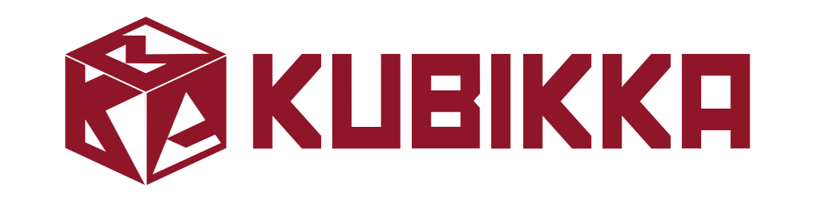

# Kubikka (Alpha)

Kubikka is a project that i am currently making, my hope is that Kubikka will be a multiplayer sandbox game where the data instead stored on local machine it will be stored on a server so anyone can see and share your creations. this version of Kubikka is mainly created to test the performance of voxel engine on the Godot Game Engine and i can definitely say it runs quite well even on lower hardware. This project is open for anyone to modify on

## CREDITS

* The voxel engine in this project mainly uses from this guy tutorial
  * [Youtube Tutorial](https://youtu.be/Q2iWDNq5PaU?feature=shared)
  * [Github Repo](https://github.com/xen-42/Minecraft-Clone)
* The character controller for this project is a modified version from this guy tutorial
  * [Youtube Tutorial](https://youtu.be/Nn2mi5sI8bM?feature=shared)